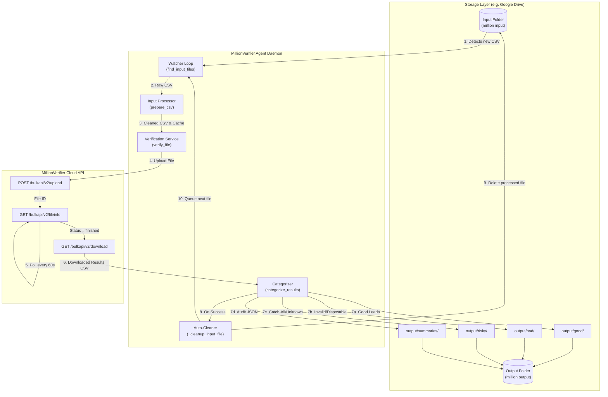

# MillionVerifier Automation Agent — Official Technical Documentation

**Version:** 1.0.0  
**Language:** Python 3.10+  
**Target Platform:** Windows / macOS / Linux  
**Repository Architecture:** Modular Service-Oriented Architecture (SOA)

---

## Table of Contents

1. [System Overview](#1-system-overview)
2. [High-Level Architecture](#2-high-level-architecture)
3. [Installation & Setup](#3-installation--setup)
4. [Configuration & Environment Variables](#4-configuration--environment-variables)
5. [CLI Command Reference](#5-cli-command-reference)
6. [Core Processing Pipeline](#6-core-processing-pipeline)
7. [Module & API Reference](#7-module--api-reference)
   - [7.1 Configuration (`app.config`)](#71-configuration-appconfig)
   - [7.2 Data Models (`app.models`)](#72-data-models-appmodels)
   - [7.3 Custom Exceptions (`app.exceptions`)](#73-custom-exceptions-appexceptions)
   - [7.4 API Client (`app.clients.millionverifier`)](#74-api-client-appclientsmillionverifier)
   - [7.5 Input Normalizer (`app.services.input_processor`)](#75-input-normalizer-appservicesinput_processor)
   - [7.6 Verification Engine (`app.services.verifier`)](#76-verification-engine-appservicesverifier)
   - [7.7 Categorizer (`app.services.categorizer`)](#77-categorizer-appservicescategorizer)
   - [7.8 Batch Processor & Daemon (`app.services.batch_processor`)](#78-batch-processor--daemon-appservicesbatch_processor)
8. [Utility Scripts](#8-utility-scripts)
   - [8.1 Offline Column Restoration (`restore_columns.py`)](#81-offline-column-restoration-restore_columnspy)
   - [8.2 Cache Cleaner (`clean_cache.py`)](#82-cache-cleaner-clean_cachepy)
   - [8.3 Test Suite (`tests_categorizer.py`)](#83-test-suite-tests_categorizerpy)
9. [Classification Rules & Categorization Matrix](#9-classification-rules--categorization-matrix)
10. [Directory Structure & Naming Conventions](#10-directory-structure--naming-conventions)
11. [Error Handling & Edge Cases](#11-error-handling--edge-cases)
12. [Troubleshooting & FAQ](#12-troubleshooting--faq)

---

## 1. System Overview

The **MillionVerifier Automation Agent** is an enterprise-grade background automation engine designed for continuous folder-to-folder email list verification. It bridges local/network/cloud storage (such as Google Drive desktop sync) with the **MillionVerifier v2 Bulk API**.

### Key Capabilities
- **Continuous Watcher Daemon:** Monitors an input directory for incoming CSV files and processes them in FIFO order.
- **Intelligent Pre-processing:** Automatically sniffs CSV dialects, locates email columns through header detection and heuristic sampling, normalizes emails, and strips blanks, malformed entries, and internal duplicates.
- **Column Preservation:** Retains all supplementary metadata columns (names, phone numbers, CRM IDs) throughout preprocessing and categorization.
- **Asynchronous Bulk Verification:** Uploads clean datasets, tracks status and estimated remaining time via non-blocking polling, and streams verified results.
- **Tri-Category Output Partitioning:** Classifies verified records into `good`, `bad`, and `risky` directories with descriptive metrics in file names.
- **Zero-Credit Offline Re-Merge:** Allows historical verification data in local cache to be merged with newly structured original input files without re-consuming API credits.
- **Automatic Cleanup & Audit Summaries:** Deletes source files upon successful categorization and saves complete JSON execution audit trails.

---

## 2. High-Level Architecture



---

## 3. Installation & Setup

### 3.1 Prerequisites
- Python 3.10 or higher
- Valid MillionVerifier API Key ([MillionVerifier Dashboard](https://app.millionverifier.com))
- Google Drive Desktop (optional, if monitoring cloud-synced folders)

### 3.2 Virtual Environment Installation

```powershell
# Clone or navigate to the project directory
cd c:\Users\test\Desktop\projects\millionverifier_agent_step1

# Create virtual environment
python -m venv .venv

# Activate virtual environment
# Windows PowerShell:
.venv\Scripts\Activate.ps1
# Windows CMD:
.venv\Scripts\activate.bat
# Linux/macOS:
source .venv/bin/activate

# Install dependencies
pip install -r requirements.txt
```

### 3.3 Dependencies (`requirements.txt`)
- `requests==2.32.5`: Resilient HTTP client for REST API communication.
- `python-dotenv==1.1.1`: Environment configuration loader.

---

## 4. Configuration & Environment Variables

Settings are loaded from the project root `.env` file via `app.config.Settings`.

### Environment Parameters

| Variable Name | Type | Default Value | Description |
| :--- | :--- | :--- | :--- |
| `MILLIONVERIFIER_API_KEY` | `str` | *None (Required)* | Secret API key provided by MillionVerifier. |
| `MILLIONVERIFIER_BULK_BASE_URL` | `str` | `https://bulkapi.millionverifier.com` | Base endpoint for bulk verification API. |
| `POLL_INTERVAL_SECONDS` | `int` | `60` | Frequency in seconds to query API job progress. |
| `WATCH_INTERVAL_SECONDS` | `int` | `15` | Polling idle delay when no files are in the input queue. |
| `DELETE_INPUT_FILE` | `bool` | `true` | When `true`, automatically deletes input file after successful processing. |
| `HTTP_TIMEOUT_SECONDS` | `int` | `60` | Request timeout for network requests. |
| `INPUT_DIR` | `str` | `G:\My Drive\million automation\million input` | Default directory path to monitor for incoming CSVs. |
| `OUTPUT_DIR` | `str` | `G:\My Drive\million automation\million output` | Default directory path where categorized CSVs are saved. |

### Sample `.env` File
```ini
MILLIONVERIFIER_API_KEY=your_api_key_here
MILLIONVERIFIER_BULK_BASE_URL=https://bulkapi.millionverifier.com
POLL_INTERVAL_SECONDS=60
WATCH_INTERVAL_SECONDS=15
DELETE_INPUT_FILE=true
HTTP_TIMEOUT_SECONDS=60
INPUT_DIR=G:\My Drive\million automation\million input
OUTPUT_DIR=G:\My Drive\million automation\million output
```

---

## 5. CLI Command Reference

The command-line interface is exposed via `app.main`.

```text
python -m app.main [COMMAND] [OPTIONS]
```

### 5.1 Commands

#### `watch` / Default (Continuous Daemon)
Monitors the configured `INPUT_DIR` continuously. When a file is placed into the folder, it is immediately processed, categorized into `OUTPUT_DIR`, deleted from `INPUT_DIR`, and the agent checks for the next file.

```powershell
# Run with defaults from .env
python -m app.main

# Explicit watch subcommand
python -m app.main watch

# Override directories and keep input files
python -m app.main watch -i "./my_inputs" -o "./my_outputs" --keep-input
```

#### `process` (Batch Runner)
Processes files in the input folder with optional continuous or single-pass behavior.

```powershell
# Run a single batch pass over current files and exit
python -m app.main process --once

# Run once with custom directories
python -m app.main process --once -i "./leads" -o "./results"
```

#### `config` (Environment Diagnostics)
Validates that the API key is configured and outputs active paths and timers.

```powershell
python -m app.main config
```

#### `prepare` (Single File Preprocessing)
Cleans and normalizes a single CSV file without uploading it to MillionVerifier.

```powershell
python -m app.main prepare "./test_emails.csv"
```

#### `clean-cache` (Purge Intermediate Files)
Deletes temporary files in local `prepared/` and `results/` folders.

```powershell
# Interactive confirmation prompt
python -m app.main clean-cache

# Bypass confirmation prompt
python -m app.main clean-cache -y
```

---

## 6. Core Processing Pipeline

When a file is picked up by `BatchProcessor.process_file()`, it traverses four distinct phases:

### Phase 1: Cleaning & Normalization (`prepare_csv`)
1. **Dialect Sniffing:** Automatically detects delimiter (comma `,`, semicolon `;`, tab `\t`, pipe `|`) and encoding (`utf-8-sig` to handle UTF-8 BOM headers).
2. **Email Column Identification:**
   - First matches common headers (`email`, `email address`, `work email`, etc.).
   - Falls back to statistical sampling of first 200 rows to find the column with the highest density of valid email formats (> 50% threshold).
3. **Record Sanitization:** Trims whitespace, lowercases email addresses, discards empty rows and malformed syntax matching `EMAIL_PATTERN`.
4. **Deduplication:** Keeps the first occurrence of each unique email and tracks discarded duplicates.
5. **Cache Output:** Writes normalized CSV with preserved original columns to `prepared/<filename>.csv`.

### Phase 2: Remote Bulk Verification (`verify_file`)
1. **Upload:** Sends the prepared CSV as multipart form-data to `/bulkapi/v2/upload`.
2. **Polling Loop:** Queries `/bulkapi/v2/fileinfo?file_id=<ID>` every 60 seconds (configurable). Logs live progress:
   ```text
   -> Job 12345: status=in_progress, progress=45% (450/1000 verified), est. remaining=35s
   ```
3. **Result Download:** Once `status == "finished"`, streams the full dataset from `/bulkapi/v2/download?filter=all` directly into `results/verified_<filename>.csv`.

### Phase 3: Classification & Categorization (`categorize_results`)
1. **Row Classification:** Inspects `quality`, `result`, and `subresult` fields according to strict business logic.
2. **Partitioning:** Writes records to:
   - `<OUTPUT_DIR>/good/<filename> - good - <good_count> good - <total_count> total.csv`
   - `<OUTPUT_DIR>/bad/<filename> - bad.csv`
   - `<OUTPUT_DIR>/risky/<filename> - risky.csv`
3. **Audit Trail Creation:** Generates a structured JSON summary in `<OUTPUT_DIR>/summaries/<filename>_run_summary.json`.

### Phase 4: Finalization & Input Deletion
1. **Source File Removal:** If `DELETE_INPUT_FILE` is `True`, unlinks the source file from `INPUT_DIR`.
2. **Queue Drain:** Instantly iterates to the next file in `INPUT_DIR` without delay.

---

## 7. Module & API Reference

### 7.1 Configuration (`app.config`)
Defined in [app/config.py](file:///c:/Users/test/Desktop/projects/millionverifier_agent_step1/app/config.py).

#### `class Settings`
Immutable configuration dataclass containing application runtime parameters.

```python
@dataclass(frozen=True)
class Settings:
    api_key: str
    bulk_base_url: str
    poll_interval_seconds: int
    watch_interval_seconds: int
    delete_input_file: bool
    http_timeout_seconds: int
    default_input_dir: Path
    default_output_dir: Path

    def require_api_key(self) -> None:
        """Raises RuntimeError if the API key is unconfigured or placeholder."""
```

---

### 7.2 Data Models (`app.models`)
Defined in [app/models.py](file:///c:/Users/test/Desktop/projects/millionverifier_agent_step1/app/models.py).

#### `class VerificationJob`
Represents an asynchronous MillionVerifier bulk verification job.

- `file_id: str`: Unique job ID from MillionVerifier.
- `file_name: str | None`: Name of uploaded file.
- `status: str`: Status state (`"created"`, `"in_progress"`, `"finished"`, `"error"`).
- `percent: int | float`: Percentage complete (0-100).
- `total_rows: int`: Total records in job.
- `unique_emails: int`: Count of distinct emails.
- `verified: int`: Processed count.
- `unverified: int`: Remaining count.
- `ok: int`: Count of valid/deliverable emails.
- `catch_all: int`: Count of catch-all domain emails.
- `disposable: int`: Count of disposable/temp inbox emails.
- `invalid: int`: Count of dead/non-existent mailboxes.
- `unknown: int`: Unresolved/greylisted count.
- `estimated_time_sec: int`: Estimated seconds until completion.
- `error: str`: Error string if job failed.

#### `class CategorizationSummary`
Encapsulates outputs produced during categorization.
- `good_count: int`
- `bad_count: int`
- `risky_count: int`
- `good_file: Path`
- `bad_file: Path`
- `risky_file: Path`

#### `class FileProcessResult`
Represents complete end-to-end telemetry for an executed batch file.
- `input_file: Path`
- `output_dir: Path`
- `status: str` (`"completed"`, `"failed"`, `"skipped"`)
- `total_input_rows: int`
- `unique_emails: int`
- `blank_emails: int`
- `malformed_emails: int`
- `duplicate_emails: int`
- `good_count: int`
- `bad_count: int`
- `risky_count: int`
- `job_id: str | None`
- `error_message: str | None`
- `started_at: str` (ISO 8601)
- `completed_at: str | None` (ISO 8601)
- `to_dict() -> dict[str, Any]`

---

### 7.3 Custom Exceptions (`app.exceptions`)
Defined in [app/exceptions.py](file:///c:/Users/test/Desktop/projects/millionverifier_agent_step1/app/exceptions.py).

- `MillionVerifierError`: Base exception for all agent domain errors.
- `MillionVerifierAPIError`: Raised when the MillionVerifier API returns an error payload (e.g., invalid key, file error).
- `MillionVerifierTransportError`: Raised on network failures, connection timeouts, or HTTP status errors.

---

### 7.4 API Client (`app.clients.millionverifier`)
Defined in [app/clients/millionverifier.py](file:///c:/Users/test/Desktop/projects/millionverifier_agent_step1/app/clients/millionverifier.py).

#### `class MillionVerifierClient`
Low-level wrapper over the MillionVerifier v2 Bulk API.

```python
class MillionVerifierClient:
    def __init__(self) -> None: ...
    def upload_csv(self, csv_path: str | Path) -> VerificationJob: ...
    def get_file_info(self, file_id: str | int) -> VerificationJob: ...
    def download_results(self, file_id: str | int, destination: str | Path, result_filter: str = "all") -> Path: ...
    def close(self) -> None: ...
```

---

### 7.5 Input Normalizer (`app.services.input_processor`)
Defined in [app/services/input_processor.py](file:///c:/Users/test/Desktop/projects/millionverifier_agent_step1/app/services/input_processor.py).

#### Functions
- `normalize_email(value: str | None) -> str`: Strips leading/trailing spaces and lowercases.
- `is_valid_email(value: str) -> bool`: RFC-compliant regex validation.
- `detect_email_column(headers: list[str], rows: list[dict[str, str]]) -> str`: Header-matching + statistical heuristic detection.
- `prepare_csv(input_file: str | Path, output_directory: str | Path = "prepared") -> PreparationResult`: Reads, detects dialect, cleans, deduplicates, and saves prepared CSV while preserving all metadata columns.

---

### 7.6 Verification Engine (`app.services.verifier`)
Defined in [app/services/verifier.py](file:///c:/Users/test/Desktop/projects/millionverifier_agent_step1/app/services/verifier.py).

#### `class VerificationService`
Coordinates upload, polling, and downloading.

```python
class VerificationService:
    def __init__(self, client: MillionVerifierClient | None = None) -> None: ...
    def verify_file(
        self,
        clean_csv_path: Path,
        download_dir: Path,
        on_progress: Callable[[VerificationJob], None] | None = None,
    ) -> tuple[VerificationJob, Path]: ...
```

---

### 7.7 Categorizer (`app.services.categorizer`)
Defined in [app/services/categorizer.py](file:///c:/Users/test/Desktop/projects/millionverifier_agent_step1/app/services/categorizer.py).

#### Functions
- `classify_row(row: dict[str, str]) -> str`: Classifies a verification result row into `'good'`, `'bad'`, or `'risky'`.
- `categorize_results(csv_path: Path, output_dir: Path, base_filename: str, total_input_count: int | None = None) -> CategorizationSummary`: Generates segregated output files in `good/`, `bad/`, and `risky/` subfolders.

---

### 7.8 Batch Processor & Daemon (`app.services.batch_processor`)
Defined in [app/services/batch_processor.py](file:///c:/Users/test/Desktop/projects/millionverifier_agent_step1/app/services/batch_processor.py).

#### `class BatchProcessor`
Orchestrates multi-file queues and continuous directory watching.

```python
class BatchProcessor:
    def __init__(
        self,
        verifier_service: VerificationService | None = None,
        prepared_cache_dir: Path | str = "prepared",
        results_cache_dir: Path | str = "results",
        delete_input_file: bool | None = None,
    ) -> None: ...

    def find_input_files(self, input_dir: Path) -> list[Path]: ...
    def process_file(self, input_file: Path, output_dir: Path) -> FileProcessResult: ...
    def run_batch_once(self, input_dir: Path, output_dir: Path) -> list[FileProcessResult]: ...
    def watch_and_process(self, input_dir: Path, output_dir: Path, watch_interval: int | None = None) -> None: ...
```

---

## 8. Utility Scripts

### 8.1 Offline Column Restoration (`restore_columns.py`)
Located at [restore_columns.py](file:///c:/Users/test/Desktop/projects/millionverifier_agent_step1/restore_columns.py).

When source files were processed in an older version or if custom CRM columns need to be re-associated with verification statuses, `restore_columns.py` merges original raw CSV files with cached verification outputs in `results/` **without making API calls or spending credits**.

#### Usage
```powershell
# Uses default input and output folders configured in .env
python restore_columns.py

# Specify custom directories
python restore_columns.py -i "C:/path/to/raw_inputs" -o "C:/path/to/outputs" -r "results" --delete-input
```

---

### 8.2 Cache Cleaner (`clean_cache.py`)
Located at [clean_cache.py](file:///c:/Users/test/Desktop/projects/millionverifier_agent_step1/clean_cache.py).

Deletes intermediate CSV files stored in `prepared/` and `results/` to reclaim local disk space.

#### Usage
```powershell
# Interactive mode (prompts before deleting)
python clean_cache.py

# Non-interactive / Force mode
python clean_cache.py -y
```

---

### 8.3 Test Suite (`tests_categorizer.py`)
Located at [tests_categorizer.py](file:///c:/Users/test/Desktop/projects/millionverifier_agent_step1/tests_categorizer.py).

Executes unit tests validating:
1. `classify_row` decision branches.
2. Output path generation and partition counters in `categorize_results`.
3. Column preservation across pre-processing and categorization.
4. Offline column merging and reconstruction logic in `restore_columns.py`.

#### Running Tests
```powershell
python tests_categorizer.py
```

---

## 9. Classification Rules & Categorization Matrix

MillionVerifier returns several diagnostic attributes per email (`quality`, `result`, `subresult`). The agent evaluates them in order of precedence:

| Priority | Evaluated Field | Value Pattern | Assigned Category | Description |
| :--- | :--- | :--- | :--- | :--- |
| **1** | `quality` | `good`, `valid` | **`good`** | Verified active mailbox. Safe for outreach. |
| **1** | `quality` | `bad`, `invalid` | **`bad`** | Dead, bounced, or syntax error. |
| **1** | `quality` | `risky`, `unknown`, `catch_all`, `catchall` | **`risky`** | Domain accepts all or greylisted. |
| **2** | `result` / `status` | `ok`, `good`, `valid` | **`good`** | Fallback deliverable confirmation. |
| **2** | `result` / `status` | `invalid`, `disposable`, `bad`, `spam_trap`, `error` | **`bad`** | Disposable inboxes, spam traps, hard bounces. |
| **2** | `result` / `status` | `catch_all`, `catchall`, `unknown`, `recheck`, `risky` | **`risky`** | Unverifiable / Server firewall. |
| **3** | `subresult` | Contains `syntax`, `disposable`, `invalid` | **`bad`** | Granular failure code. |
| **3** | `subresult` | Contains `catch_all`, `timeout`, `greylist` | **`risky`** | Granular unverifiable code. |
| **4** | *(Fallback)* | Any unrecognized value | **`risky`** | Safe-fail fallback to prevent losing contacts. |

---

## 10. Directory Structure & Naming Conventions

### 10.1 Workspace Tree
```text
millionverifier_agent_step1/
│
├── app/
│   ├── __init__.py
│   ├── config.py                 # Settings & env parser
│   ├── exceptions.py             # Domain exception types
│   ├── models.py                 # Dataclasses & API DTOs
│   ├── main.py                   # CLI entry point
│   ├── clients/
│   │   ├── __init__.py
│   │   └── millionverifier.py   # Bulk API client
│   └── services/
│       ├── __init__.py
│       ├── input_processor.py    # Dialect detection & cleaner
│       ├── verifier.py           # Polling & download coordinator
│       ├── categorizer.py        # Tri-folder output classifier
│       └── batch_processor.py   # Continuous watcher loop
│
├── prepared/                     # Local temporary cache for cleaned files
├── results/                      # Local temporary cache for downloaded API results
├── restore_columns.py            # Offline zero-credit column re-merger
├── clean_cache.py                # Disk cleanup tool
├── tests_categorizer.py          # Complete unit test suite
├── test_emails.csv               # Sample test dataset
├── requirements.txt              # Production dependencies
├── .env                          # Local credentials & paths
└── DOCUMENTATION.md              # Official technical documentation
```

### 10.2 Destination Folder Hierarchy & File Naming
Given an input file named `Q3_Leads_NewYork.csv` with **1,000 raw rows** resulting in **750 good**, **150 bad**, and **100 risky** records:

```text
<OUTPUT_DIR>/
├── good/
│   └── Q3_Leads_NewYork - good - 750 good - 1000 total.csv
├── bad/
│   └── Q3_Leads_NewYork - bad.csv
├── risky/
│   └── Q3_Leads_NewYork - risky.csv
└── summaries/
    └── Q3_Leads_NewYork_run_summary.json
```

---

## 11. Error Handling & Edge Cases

| Scenario | Agent Behavior |
| :--- | :--- |
| **Non-CSV Files in Input Folder** | Ignored automatically (filters for `.csv` extension and skips hidden `.` or `~` temporary office files). |
| **No Email Column Detected** | Raises `ValueError`, marks file status as `failed` in summary JSON, and skips to next file without crashing daemon. |
| **Zero Valid Emails in File** | Marks status as `skipped`, writes summary JSON, removes file if auto-delete enabled, and proceeds immediately. |
| **API Rate Limiting / 5xx Errors** | Handled with `MillionVerifierTransportError` and logged; job status polling retries on next poll interval. |
| **Invalid or Expired API Key** | `require_api_key()` halts startup with clear instructions before consuming resources. |
| **Special Characters in CSV / UTF-8 BOM** | Decoded with `utf-8-sig` to prevent corrupted column headers like `\ufeffEmail`. |

---

## 12. Troubleshooting & FAQ

### Q1: The agent says "Waiting for files to arrive..." but my file is in the folder.
- Ensure the file has a `.csv` extension (Excel `.xlsx` or `.xls` files must be exported to `.csv` first).
- Check that the file is not currently locked open by Microsoft Excel.
- Verify that `INPUT_DIR` in `.env` matches your Google Drive or local path. Run `python -m app.main config` to verify.

### Q2: How can I prevent the input file from being deleted?
Set `DELETE_INPUT_FILE=false` in your `.env` file, or launch the agent with the `--keep-input` flag:
```powershell
python -m app.main watch --keep-input
```

### Q3: Why are my original columns (e.g. Phone, Company) missing in the output?
All original columns are preserved by default in the current pipeline. If you have older verification result files in `results/`, run:
```powershell
python restore_columns.py
```

### Q4: How do I stop the continuous watcher?
Press `Ctrl + C` in your terminal. The agent will cleanly shut down after the current step.
